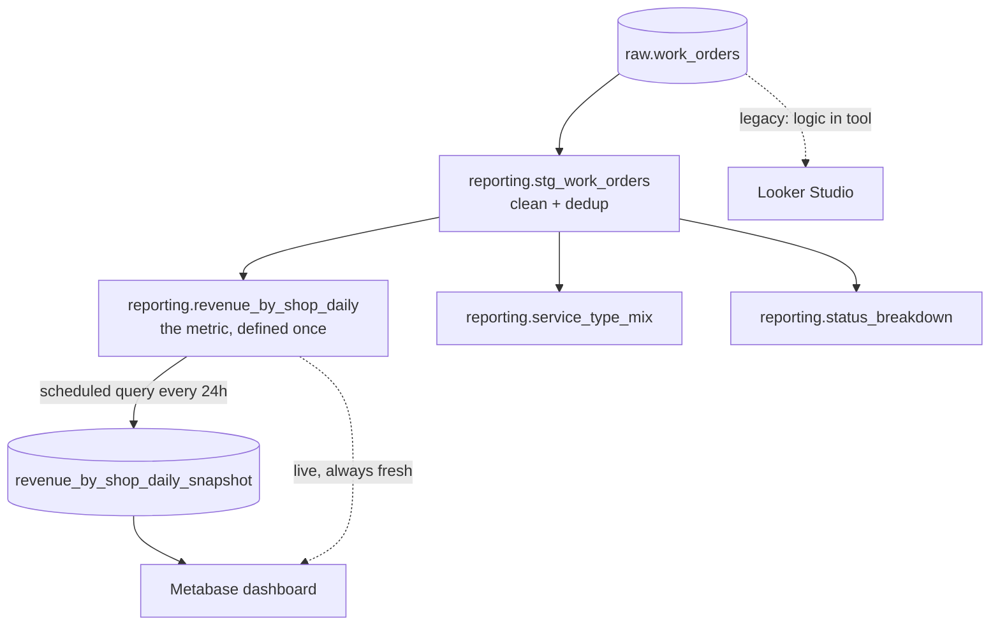

# Project 2 — Dashboard Migration POC - How to Run Guide

Builds on Project 1's BigQuery data. Demonstrates migrating a BI dashboard
from a "logic-in-the-BI-tool" setup (Looker Studio on raw data) to a
"logic-in-the-warehouse" setup (BigQuery views + scheduled snapshot, read by
self-hosted Metabase) — and proves the numbers match.

## What gets created (all new, no overlap with Project 1)

| Object | Type | Naming |
|---|---|---|
| `reporting` | BigQuery dataset (US) | new layer alongside raw/staging/marts |
| `reporting.stg_work_orders` | view | cleaned/deduped over raw |
| `reporting.revenue_by_shop_daily` | view | primary metric |
| `reporting.service_type_mix` | view | breakdown tile |
| `reporting.status_breakdown` | view | status funnel tile |
| `reporting.revenue_by_shop_daily_snapshot` | table | materialized by scheduled query |
| `reporting-daily-revenue-refresh` | scheduled query | every 24h |
| `bi-metabase` | service account | read-only BI identity |

## Run order

- **A.** Enable the Data Transfer API.
- **B.** Create the `reporting` dataset and the four views (in numeric order).
- **C.** Create + run the scheduled query (materialize the snapshot now too).
- **D.** Create the `bi-metabase` service account + key.
- **E.** `cp metabase/.env.example metabase/.env`, edit it, `docker compose up -d`.
- **Looker Studio:** build the "legacy" dashboard in the UI (no CLI exists).
- **Validate:** run `docs/VALIDATION.md` section 2; expect `mismatched_rows = 0`.

See the chat message for the exact bash for each step.

## Folder map

```
gcp-dashboard-poc/
├── reporting/        # BigQuery view DDL + the snapshot SELECT
├── metabase/         # docker-compose + .env.example
└── docs/VALIDATION.md
```

# Docummentation of Project Workingalkthrough + interview prep


## Table of contents

1. [The big picture: what "migrating a dashboard" even means](#part-1--the-big-picture)
2. [Every component, explained like you're new](#part-2--every-component-explained)
3. [What each build step actually did](#part-3--what-each-build-step-did)
4. [The errors: what broke, why, and how we fixed it](#part-4--the-errors)
5. [Interview prep: concepts + questions & answers](#part-5--interview-prep)
6. [Glossary](#glossary)

---

## Part 1 — The big picture

### What we built, in one sentence

We took the **same data from Project 1** and built a business dashboard on it
**twice** — first the "old way" (logic crammed inside the BI tool), then the
"new way" (logic pushed down into the data warehouse) — and then **proved the
two produce identical numbers.** That second build is "the migration."

### Wait — why would anyone migrate a dashboard?

This is the part to really understand, because it's the *point* of the whole
project and the thing an interviewer probes.

Imagine a company where every team builds its own dashboard. The finance
dashboard computes "revenue" one way. The sales dashboard computes it slightly
differently. Marketing has a third version. **Each dashboard re-implements the
business logic inside its own BI tool.** Now three dashboards show three
different revenue numbers, nobody trusts any of them, and every meeting starts
with an argument about whose number is right.

The fix is to **move the logic out of the dashboards and into one shared place —
the data warehouse.** You define "revenue" exactly once, as SQL in BigQuery.
Every dashboard, notebook, or report then reads that one definition. Now all
tools agree by construction. That move — *pulling transformation logic out of the
presentation layer and pushing it down into the warehouse* — is what "migrating"
means here.

### The analogy: a shared recipe vs. everyone improvising

| Legacy way | Migrated way |
|---|---|
| Every cook improvises the house sauce from memory | One master recipe in a shared cookbook |
| Sauces taste different at every table | Every plate tastes identical |
| Fix a mistake → re-teach every cook | Fix the recipe once → everyone's fixed |
| The "logic" lives in people's heads (the BI tool) | The "logic" lives in the cookbook (the warehouse) |

In our build, the "shared cookbook" is the set of BigQuery **views** in the
`reporting` dataset. The dashboards (Looker Studio, then Metabase) become thin —
they just *display* what the warehouse already computed.

### Before and after, concretely

```
LEGACY (logic in the BI tool)
  raw.work_orders ───────────────► Looker Studio
                                   (does the cleaning, dedup, SUM, filters
                                    inside the report itself)

MIGRATED (logic in the warehouse)
  raw.work_orders
        │
        ▼  (BigQuery views = the shared recipe)
  reporting.stg_work_orders   ← clean + dedup
        │
        ▼
  reporting.revenue_by_shop_daily  ← the metric, defined once
        │
        ├──────────────► (live view, always fresh)
        │
        ▼  scheduled query, every 24h
  reporting.revenue_by_shop_daily_snapshot  ← pre-computed table
        │
        ▼
  Metabase (thin — just reads and charts the modeled data)
```



The headline idea: **the BI tool got dumber and the warehouse got smarter — and
that's the improvement.** A dumb BI tool reading a smart warehouse is consistent,
fast, cheap, and version-controlled.

---

## Part 2 — Every component explained

### 2.1 The `reporting` dataset — the serving layer

A new BigQuery **dataset** (folder of tables/views), created in the **`US`
location** to match `raw`/`staging`/`marts` (datasets in different locations
can't be queried together).

Where it fits in the layering from Project 1:

- **raw** → untouched source
- **staging / marts** → dbt's modeled layers
- **reporting** → the layer specifically shaped for BI tools to read

We kept `reporting` separate from dbt's `marts` on purpose, so the hand-built BI
views never collide with dbt's outputs. (In a mature setup you'd build
`reporting` *on top of* the dbt marts so there's a single source of truth rather
than two copies of the logic — that's noted as a hardening step in the validation
doc.)

### 2.2 Views — saved queries, not stored data

A **view** is a *saved SQL query* with a name. It stores **no data of its own**.
Every time you query a view, BigQuery re-runs its underlying SQL against the live
source tables and hands you fresh results.

**Analogy:** a view is a *saved search*, not a *saved file*. It always reflects
the current data, but it does the work again on every read.

The four views we created (run in order — the first feeds the rest):

1. **`reporting.stg_work_orders`** — the cleaning step. Deduplicates by
   `work_order_id` (keeping the latest by `updated_at` using `ROW_NUMBER()`),
   standardizes text (`INITCAP` on make, `LOWER` on status), and filters out
   negative-cost junk. This is the cleaning logic that *used to* live in the BI
   tool, now expressed once in SQL.
2. **`reporting.revenue_by_shop_daily`** — the headline metric: completed-order
   revenue and order counts per shop per day.
3. **`reporting.service_type_mix`** — revenue and average ticket by service line.
4. **`reporting.status_breakdown`** — counts and value by order status.

Each downstream view reads from `stg_work_orders`, so the cleaning rules are
defined **once** and inherited everywhere. Change the dedup logic in one place
and all three metrics update.

### 2.3 The scheduled query + snapshot — pre-computing for speed

**The tension:** a view is always fresh but **recomputes on every read**. If a
dashboard hits `revenue_by_shop_daily` a hundred times a day, BigQuery re-scans
the data a hundred times — slower and more expensive.

**The fix — materialize it:** run the view's query on a schedule and save the
*result* into a real table. Reading a table is instant (the numbers are already
sitting there). We did this with a **scheduled query**:

- **`reporting-daily-revenue-refresh`** runs `SELECT * FROM revenue_by_shop_daily`
  **every 24 hours** and writes the result into the table
  **`reporting.revenue_by_shop_daily_snapshot`**, overwriting it each time
  (`--replace=true`).

**View vs. snapshot — the tradeoff in one line:** the **view** is always
up-to-the-second but slower per read; the **snapshot** is lightning-fast but only
as fresh as the last refresh.

This is BigQuery's **Data Transfer Service** under the hood (the thing that
popped the OAuth consent — see Part 4).

**AWS/Azure parallel:** like a scheduled job that refreshes a materialized table,
or AWS Athena CTAS run on a schedule.

### 2.4 Looker Studio — the "legacy" dashboard

**What it is:** Google's free, browser-based BI tool with a native BigQuery
connector. You drag fields onto charts in a point-and-click editor.

**Its role here:** the deliberate "before" state. We pointed Looker Studio
**directly at `raw.work_orders`** and made it do the aggregating (SUM of
`total_cost`, filter `status = completed`) **inside the report**. That's the
anti-pattern we're migrating away from: the logic is trapped in the dashboard.

**Why no bash for this part:** Looker Studio has no CLI or API to *build* reports
— it's point-and-click only. That's why this one step was UI clicks while
everything else was scripted.

**AWS/Azure parallel:** AWS QuickSight; Microsoft Power BI.

### 2.5 Metabase — the self-hosted "modern" dashboard

**What it is:** an open-source BI tool you **run yourself** (rather than a managed
Google product). You point it at a database, and it gives you a polished UI for
questions and dashboards.

**Its role here:** the "after" tool. It connects to BigQuery and reads the
**already-modeled** `reporting` views/snapshot. Because the warehouse did the
thinking, Metabase's "questions" are basically "show me this table" — thin and
consistent.

**How we ran it — Docker + docker-compose:**

- **Docker** packages an app and its dependencies into a **container** that runs
  the same everywhere. "Self-hosting Metabase" = running its official container.
- **docker-compose** describes a *multi-container* app in one YAML file and starts
  them together with `docker compose up -d`.
- We ran **two** containers:
  - `metabase` — the app itself (a Java app, listening on port 3000).
  - `metabase-db` — a **Postgres** database that stores Metabase's *own* metadata
    (your dashboards, saved questions, users).

**Why a separate Postgres instead of Metabase's default?** Out of the box
Metabase stores its metadata in **H2**, a tiny file-based database that lives
inside the container. If that container is removed or upgraded, **your dashboards
can vanish.** Pointing Metabase at a real Postgres with a **named volume**
(`metabase-db-data`) makes that metadata durable across restarts and upgrades.
This is a best-practice talking point: *never run production Metabase on H2.*

**Two different databases — don't confuse them:**
- **Postgres (metabase-db)** = where Metabase keeps *its own* dashboards/users.
- **BigQuery** = the *analytics data* Metabase reads to draw charts.
These are unrelated; Metabase needs both.

**AWS/Azure parallel:** self-hosting on a VM/container service is like running
Metabase on EC2/ECS or Azure Container Apps, versus a managed BI service.

### 2.6 The `bi-metabase` service account — read-only BI identity

Metabase needs to authenticate to BigQuery. We made a **dedicated service
account**, `bi-metabase`, separate from Project 1's `platform-runtime`, and gave
it only:

- `roles/bigquery.jobUser` — may run queries.
- `roles/bigquery.dataViewer` — may *read* data (no write, no delete).

**Why a separate, read-only identity?** Least privilege again. A dashboard tool
should never be able to modify or delete data — only read it. If Metabase (or its
key) is compromised, the worst case is someone reads data, not destroys it.

**The key file (`bi-metabase-key.json`):** Metabase authenticates with a
service-account **key** — a credential file you upload into Metabase. This is a
real secret: it's in `.gitignore`, and you must never commit or share it.

**Hardening (great to mention):** key files are long-lived and risky. In
production you'd prefer **keyless** auth (workload identity when running on GCP),
and you'd scope the reader to **just the `reporting` dataset** — or use
**authorized views** so Metabase can read the views without direct access to
`raw`. We used a project-wide read role for POC simplicity and documented the
tightening.

### 2.7 The validation doc — proving the migration is correct

A migration is worthless if the new numbers don't match the old ones. The
validation step **independently recomputes** the headline metric straight from
`raw` and **diffs** it against the migrated view. The comparison query counts
rows where the two disagree:

```sql
-- (simplified) compare migrated view vs an independent recomputation
SELECT COUNT(*) AS mismatched_rows
FROM migrated m
FULL OUTER JOIN independent i USING (shop_id, order_date)
WHERE m.work_orders IS DISTINCT FROM i.work_orders
   OR ABS(COALESCE(m.revenue,0) - COALESCE(i.revenue,0)) > 0.01;
```

**Pass condition: `mismatched_rows = 0`.** If even one (shop, day) disagreed, the
migration changed the numbers and you'd investigate. This is how you turn "trust
me, it matches" into evidence.

---

## Part 3 — What each build step did

**A — Enable the Data Transfer API.** Scheduled queries run on BigQuery's Data
Transfer Service, which is off by default. One `gcloud services enable`.

**B — Create the `reporting` dataset + the four views.** Made the dataset in
`US`, then created the views **in numeric order** (`01` first, because `02–04`
read from it). *This is where the two view-loading errors happened — Part 4.*

**C — Create + populate the snapshot.** Created the scheduled query for the
recurring 24h refresh, then ran the same `SELECT` once manually to fill the
snapshot table immediately (so we didn't wait a day for the demo). *The first
command triggered a one-time OAuth consent — Part 4.*

**D — Create the read-only BI service account + key.** Made `bi-metabase`,
granted `jobUser` + `dataViewer`, and generated `bi-metabase-key.json` for
Metabase to authenticate with.

**E — Launch Metabase.** Copied `.env.example` to `.env`, set a password for the
Metabase metadata DB, and `docker compose up -d` to start Metabase + Postgres.
Then in the UI: add a BigQuery database, upload the key, scope to `reporting`.

**Looker Studio (UI).** Built the legacy dashboard pointing at `raw` directly.

**Validate.** Ran the comparison query expecting `mismatched_rows = 0`.

---

## Part 4 — The errors

Three things tripped us up: two were about **how the `bq` command-line tool reads
SQL**, and one was a scare that turned out to be an **upstream data problem, not a
Project 2 bug at all.**

### Error 1 — "Table `reporting.stg_work_orders` was not found"

**What you ran:**
```bash
bq query --use_legacy_sql=false < reporting/02_revenue_by_shop_daily.sql
```
**The error:** `Not found: Table ...reporting.stg_work_orders was not found in
location US`.

**What it really meant:** view `02` reached BigQuery and executed, but it
references `stg_work_orders`, which **didn't exist** — meaning view `01` had
**not actually been created**, even though the command for it appeared to run.

This is a classic **dependency-order failure with a misleading message**. The
error points at `02`, but the *cause* is `01` missing. Whenever you see "X not
found" and X is something you thought you just created, suspect that the creation
of X silently failed.

The `< file.sql` (stdin redirect) form didn't reliably register the view-creation
statement in that invocation. Rather than chase exactly why the redirect
misbehaved, the right move was to switch to a form that fails **loudly and
deterministically** — which immediately surfaced the true root cause (Error 2).

### Error 2 — `FATAL Flags parsing error: Unknown command line flag`

**What you ran** (the next attempt, passing the file as an argument):
```bash
bq query --use_legacy_sql=false "$(cat reporting/01_stg_work_orders.sql)"
```
**The error:**
```
FATAL Flags parsing error: Unknown command line flag ' reporting.stg_work_orders
-- The "pushed-down" cleaning logic...
```

**The root cause (this is the real one):** our SQL files start with **comment
lines**, and SQL line-comments begin with `--`:
```sql
-- reporting.stg_work_orders
-- The "pushed-down" cleaning logic...
CREATE OR REPLACE VIEW ...
```
The `bq` command-line tool treats **anything starting with `--` as a
command-line flag** (like `--use_legacy_sql`). When the SQL text — comments and
all — got passed to `bq`, it hit `-- The "pushed-down"...` and thought you were
trying to pass a flag called `The`. It had no such flag, so it aborted with a
flags-parsing error.

So **both** Error 1 and Error 2 trace to the same villain: **leading `--` comment
lines colliding with how `bq` parses its input.**

**The fix — strip the comment lines before handing SQL to `bq`:**
```bash
for f in reporting/01_stg_work_orders.sql \
         reporting/02_revenue_by_shop_daily.sql \
         reporting/03_service_type_mix.sql \
         reporting/04_status_breakdown.sql; do
  echo ">> running $f"
  grep -v '^[[:space:]]*--' "$f" | bq query --use_legacy_sql=false || { echo "FAILED on $f"; break; }
done
```
- `grep -v '^[[:space:]]*--' "$f"` prints every line **except** those that start
  with optional whitespace then `--` (i.e., it deletes the comment lines).
- The cleaned SQL is **piped** into `bq`, which now sees only real SQL.
- The `|| { echo ...; break; }` stops the loop at the first real failure so you
  know exactly which file broke.

Result: all four views created, in order, cleanly.

**Three lessons:**
- A tool's CLI and a file's content can have **clashing special characters**.
  `--` means "comment" to SQL and "flag" to many CLIs. Same with `;`, quotes, etc.
- When a quiet failure cascades into a confusing downstream error ("X not found"),
  switch to a form that **fails loudly** to reveal the true cause.
- The SQL itself was always correct — the same files load fine in the BigQuery
  **console** or via **dbt**, which don't parse `--` as flags. The bug was purely
  in the *delivery mechanism*, not the logic.

### Error 3 — `snapshot_rows = 0` (the upstream-data scare)

**The symptom:** after creating and populating the snapshot, every count came
back **0** — `snapshot_rows = 0`, and a `GROUP BY status` on `raw.work_orders`
returned **nothing at all**.

**The reasoning that mattered:** an empty `GROUP BY` result is the tell that the
**source table itself was empty** — not that the reporting views were wrong. We
verified the reporting layer was built correctly; it was simply sitting on top of
an empty `raw.work_orders`.

**The actual root cause was upstream, in Project 1:** the generator was returning
HTTP 200 but its asynchronous Pub/Sub publishes were being killed when Cloud Run
scaled the instance to zero, so no events ever reached BigQuery. (Full
detective story and fix in the **Project 1 documentation, Part 4** — collect the
publish futures and `.result()` on them before returning.) Once that was fixed
and the generator re-fired, rows landed in `raw`, and re-running the snapshot
materialize lit up the dashboard.

**Why this is worth documenting even though the bug was upstream:** the valuable
skill on display is **correctly attributing a symptom to the right layer.** A
0-row dashboard *looks* like a dashboard bug. The disciplined move was to ask
"is my layer wrong, or is my input empty?" — confirm the input first — and avoid
wasting time rebuilding a `reporting` layer that was already correct.

> Side note (not an error): when you first created the scheduled query, `bq`
> printed an authorization URL and asked for a `version_info`. That's expected —
> BigQuery's **Data Transfer Service** needs a **one-time OAuth consent** to run
> queries on your behalf on a schedule. You approve once in the browser, paste
> the token back, and it never asks again.

---

## Part 5 — Interview prep

### 5.1 The migration story (the centerpiece)

**Q: Tell me about your dashboard-migration project.**
> "I had a streaming pipeline landing work-order data in BigQuery. I built a
> dashboard on it twice to demonstrate a migration. The 'legacy' version was a
> Looker Studio report pointed straight at the raw table, doing all its cleaning
> and aggregation inside the BI tool. The 'migrated' version pushed that logic
> down into BigQuery as a layer of SQL views plus a scheduled query that
> materializes the daily metric, and I rebuilt the dashboard in self-hosted
> Metabase reading that modeled layer. Then I wrote a validation that
> independently recomputes the headline metric and diffs it against the migrated
> view — it had to come back with zero mismatched rows, which it did."

**Q: Why is moving logic out of the BI tool into the warehouse an improvement?**
> "Single source of truth. When each dashboard re-implements 'revenue,' tools
> disagree and nobody trusts the numbers. Defining the metric once in the
> warehouse means every tool reads the same definition, so they agree by
> construction. It's also faster and cheaper because you can pre-compute, it's
> version-controllable as SQL in git, and it's testable. The BI tool becomes a
> thin presentation layer, which is where you want the complexity to *not* be."

**Q: What are the risks or downsides of this migration?**
> "You add a modeling layer to maintain, and you trade some flexibility — analysts
> can't just whip up arbitrary logic in the BI tool anymore; changes go through
> the warehouse. And you must validate that the migrated numbers match the
> originals, or you've silently changed reporting. That validation step is
> non-negotiable."

### 5.2 Views, tables, and materialization

**Q: What's the difference between a view and a table?**
> "A table stores data. A view stores a query — it re-runs against live data every
> time you read it and stores nothing itself. Views are always fresh but recompute
> on each read."

**Q: What's a materialized snapshot and why use one?**
> "It's a real table I fill periodically from a view's result via a scheduled
> query. Reading it is instant because the numbers are pre-computed, which is
> great for a dashboard hit many times a day. The tradeoff is staleness — it's
> only as current as the last refresh. I used a 24-hour refresh, so the live view
> is always current and the snapshot lags by up to a day, which is fine for a
> daily revenue report."

**Q: How would you decide between querying the live view vs. the snapshot?**
> "How fresh does the consumer need the data, and how often/expensively is it
> queried? Real-time needs → live view. High-traffic dashboard where a day-old
> daily aggregate is acceptable → snapshot. You can even expose both and let the
> user choose."

**Q: What's a scheduled query?**
> "A BigQuery feature, part of the Data Transfer Service, that runs a SQL
> statement on a schedule and writes the result to a destination table. I used it
> to refresh my snapshot every 24 hours with overwrite semantics."

### 5.3 BI tooling

**Q: Looker Studio vs. Metabase — why both?**
> "Looker Studio was my 'legacy' tool — managed, free, Google-native, but I had it
> doing logic inside the report, which is the pattern I was migrating away from.
> Metabase was the 'modern' self-hosted tool reading the already-modeled data.
> The contrast *is* the project: same data, logic in the tool vs. logic in the
> warehouse."

**Q: You self-hosted Metabase with Docker — why a separate Postgres instead of the default?**
> "Metabase stores its own metadata — dashboards, questions, users. The default is
> an embedded H2 file inside the container, which you can lose on a restart or
> upgrade. I backed it with a Postgres container and a named volume so that
> metadata is durable. Running production Metabase on H2 is a known anti-pattern."

**Q: That's two databases — clarify their roles.**
> "Postgres holds Metabase's *own* state. BigQuery holds the *analytics data*
> Metabase charts. Completely separate; Metabase needs both."

### 5.4 Security

**Q: How did Metabase authenticate to BigQuery, and how would you harden it?**
> "A dedicated read-only service account, `bi-metabase`, with only `jobUser` and
> `dataViewer` — it can run queries and read data, nothing more. Metabase
> authenticates with that account's key file, which is gitignored. To harden:
> drop the key file in favor of keyless workload identity when running on GCP,
> and scope the account to just the `reporting` dataset — or use authorized views
> so it never needs direct access to raw."

**Q: Why read-only for a BI tool?**
> "A dashboard should never write or delete data. Read-only means even a full
> compromise of Metabase can't corrupt or destroy the warehouse — the blast
> radius is limited to data exposure, not data loss."

### 5.5 Data validation

**Q: How did you prove the migrated dashboard was correct?**
> "I re-derived the headline metric independently — straight from raw, applying
> the same agreed spec — and full-outer-joined it against the migrated view,
> counting any (shop, day) where order counts or revenue disagreed beyond a
> rounding tolerance. The pass condition was zero mismatched rows. I also checked
> the snapshot equals the live view right after a refresh. That turns 'it looks
> right' into evidence."

**Q: Why a tolerance like `> 0.01` on the revenue comparison?**
> "Floating-point sums can differ in the last decimal depending on order of
> operations, so an exact-equality check can throw false failures. A one-cent
> tolerance treats economically-identical results as equal while still catching
> any real discrepancy."

### 5.6 Debugging & operations

**Q: Your dashboard showed zero data. How did you tell whether it was a dashboard bug or a data problem?**
> "I checked the input before blaming my layer. A `GROUP BY` on the source
> returned no rows at all, which meant the source table was empty — so the
> reporting views were fine and the problem was upstream in the ingestion
> pipeline. The lesson is to attribute a symptom to the right layer before
> rebuilding anything: confirm your inputs first."

**Q: You hit a CLI error feeding SQL to `bq`. What happened?**
> "My `.sql` files started with `--` comment lines, and `bq` reads `--` as the
> start of a command-line flag, so it tried to parse my SQL comments as flags and
> aborted. I fixed it by stripping comment lines before piping the SQL in. The SQL
> was always valid — it loaded fine in the console and via dbt; the issue was the
> CLI's input parsing, not the query."

**Q: General principle from that?**
> "Special characters can mean different things to different layers — `--` is a
> comment to SQL but a flag prefix to the CLI. And when a silent failure produces
> a confusing downstream error, switch to a form that fails loudly to find the
> real cause fast."

### 5.7 STAR write-up: the `bq` comment-parsing bug

> **Situation:** "Loading my BigQuery view definitions through the `bq` CLI kept
> failing — first a misleading 'table not found' on a dependent view, then a fatal
> flags-parsing error."
>
> **Task:** "Get four dependent views created reliably from `.sql` files."
>
> **Action:** "The flags error gave it away: my SQL files began with `--` comment
> lines, and `bq` interprets `--` as a command-line flag, so it choked on the
> comments. The earlier 'table not found' was the same root cause — the first
> view silently never got created, so the second couldn't find it. I stripped the
> comment lines with `grep` before piping the SQL into `bq`, and added a guard to
> stop the loop on the first real failure."
>
> **Result:** "All four views created in dependency order. Takeaways: watch for
> special characters that mean different things to the CLI vs. the file format,
> and prefer commands that fail loudly so a quiet failure can't cascade into a
> confusing one."

---

## Glossary

- **Authorized view:** a view granted permission to read a source dataset, so
  readers of the view don't need direct access to the underlying tables.
- **BI tool:** software for building dashboards/reports (Looker Studio, Metabase).
- **Container / Docker:** an app packaged with its dependencies to run identically
  anywhere.
- **docker-compose:** a file + command to run multiple containers together.
- **Data Transfer Service:** the BigQuery subsystem that runs scheduled queries.
- **H2:** a small embedded file database (Metabase's fragile default metadata DB).
- **Least privilege:** granting only the minimum permissions needed.
- **Materialize:** to save a query's *result* as a physical table.
- **Medallion / layered warehouse:** raw → staging → marts/reporting refinement.
- **Named volume:** Docker-managed storage that persists across container restarts.
- **Scheduled query:** SQL that runs on a schedule and writes to a destination
  table.
- **Service account (read-only):** a non-human identity granted only read access.
- **Single source of truth:** one authoritative definition every consumer shares.
- **Snapshot:** a point-in-time materialized copy; fast to read, stale between
  refreshes.
- **View:** a saved query that stores no data and is always fresh on read.
- **WRITE_TRUNCATE / `--replace`:** overwrite the destination table on each run.
